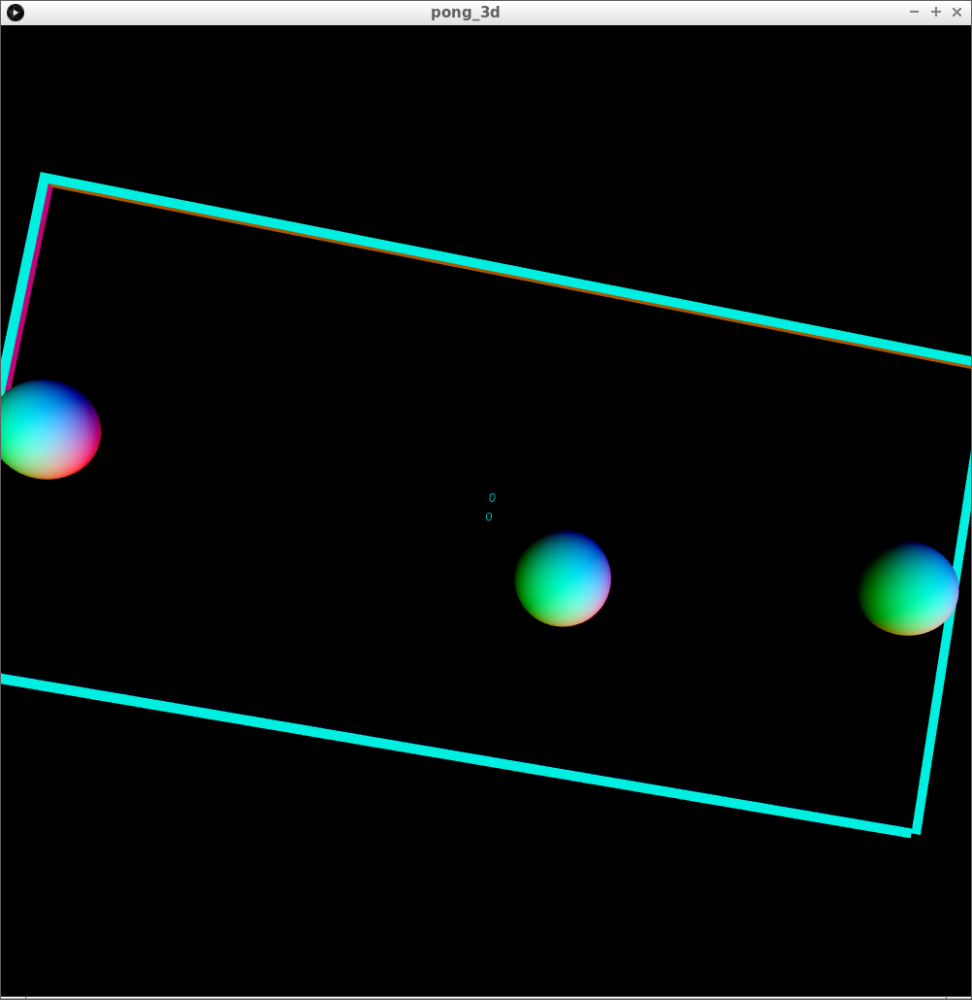
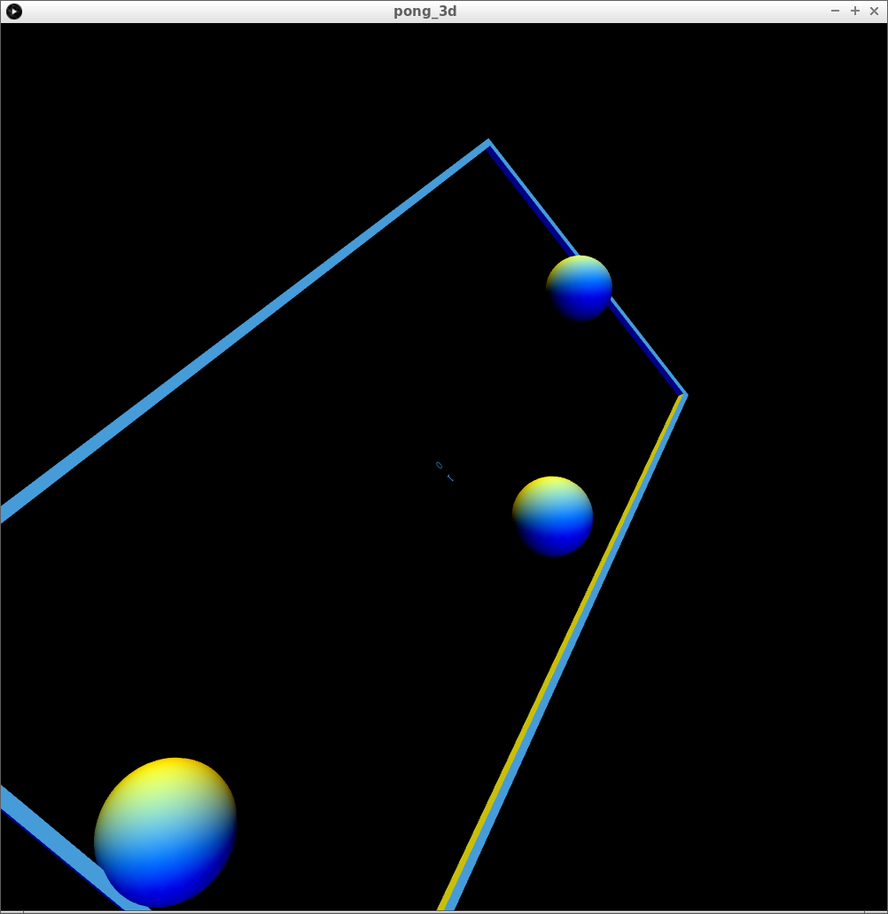

# pong_3d

Pong in 3D, written in Arduino and Processing

 * Arduino coding: Richel Bilderbeek
 * Processing coding: Richel Bilderbeek
 * Machine building: Carmen IJsebaart
 * Machine painting: Carmen IJsebaart
 * Machine schematics: Richel Bilderbeek
 * Putting machine schematics into Fritzing: Carmen IJsebaart

## Machine

## Game

## Fritzing schematics

## Music

From [openmusicarchive.org](http://openmusicarchive.org/audio/Eddies_Twister.mp3):

 * Eddie Lang
 * Eddie's Twister
 * Written by Eddie Lang (1904 - 1933)
 * Performed by Ed Lang (guitar solo with piano)
 * Recording date: n/a
 * Cat Number: Okeh 40807
 * Duration: 02'53"
 * License: Public Domain

## Machine before adding paint

## Older screenshots

